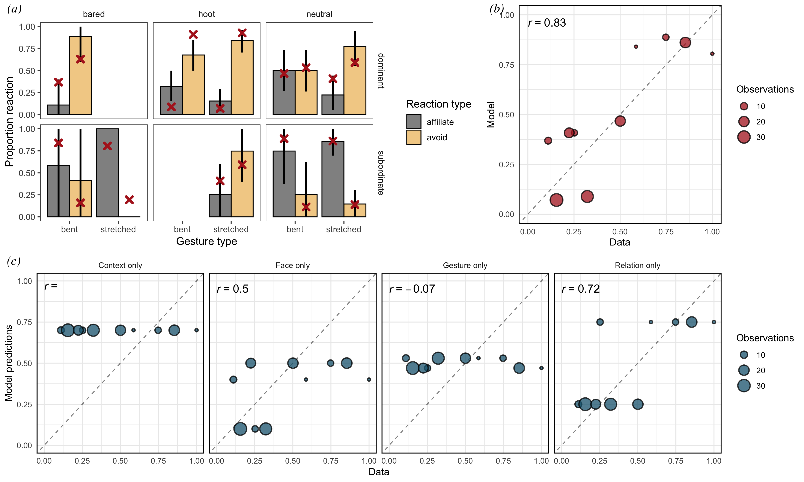
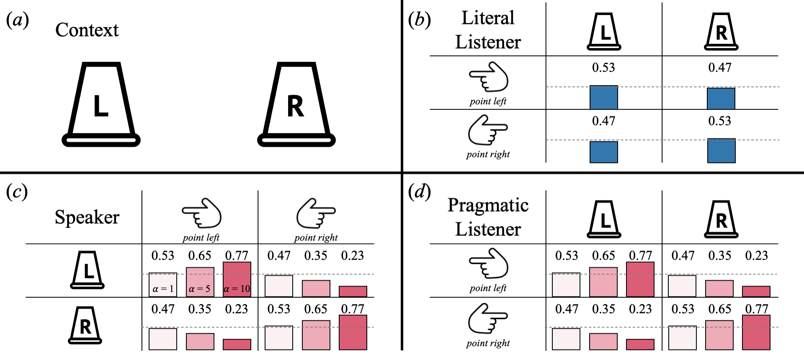

```{r setup, include = FALSE}
library(papaja)
library(tidyverse)
```


```{r fig1, include = T, fig.align = "center", fig.cap = "...", out.width="100%"}

```

Awesome paper [@levinson2006human; @brentari2017language].

```{r fig2, include = T, fig.align = "center", fig.cap = "...", out.width="100%"}

```


\begin{equation}
P^{no\_wk}_{L_1}(r \mid u; \{\rho_i, \alpha_i\, \theta_{i}\})\propto P_{S_1}(u \mid r; \{\alpha_i, \theta_{i}\}) \cdot P(r \mid \rho_i)
\end{equation}


\newpage

# References
```{r create_r-references}
r_refs(file = "r-references.bib")
```

\begingroup
\setlength{\parindent}{-0.5in}
\setlength{\leftskip}{0.5in}

<div id = "refs"></div>
\endgroup

# Acknowledgements

